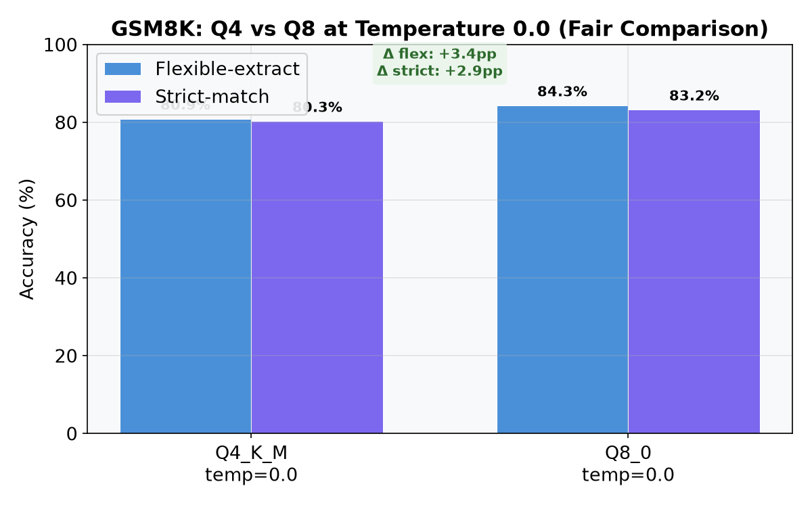
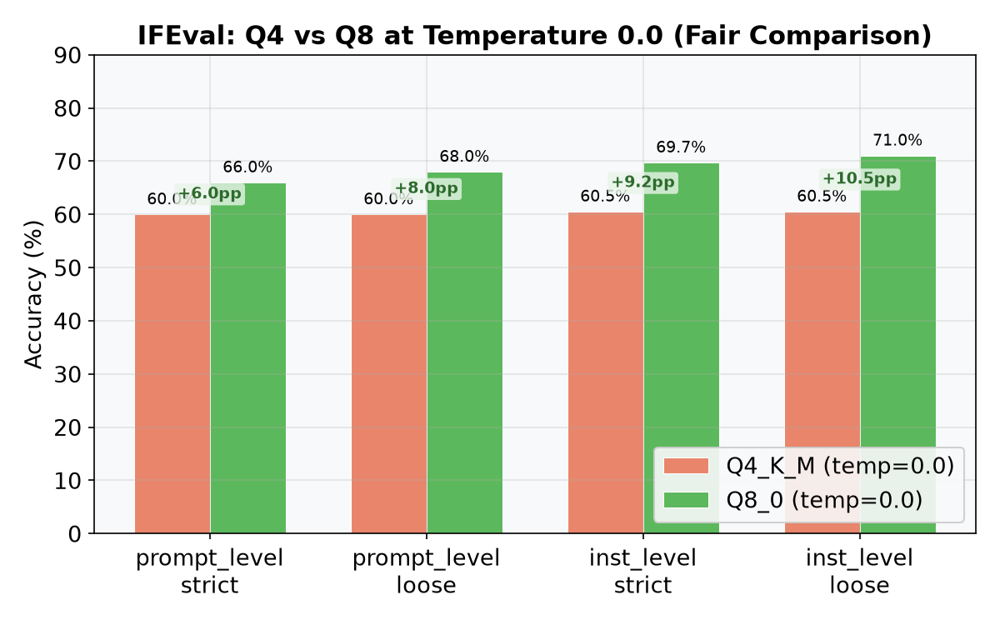
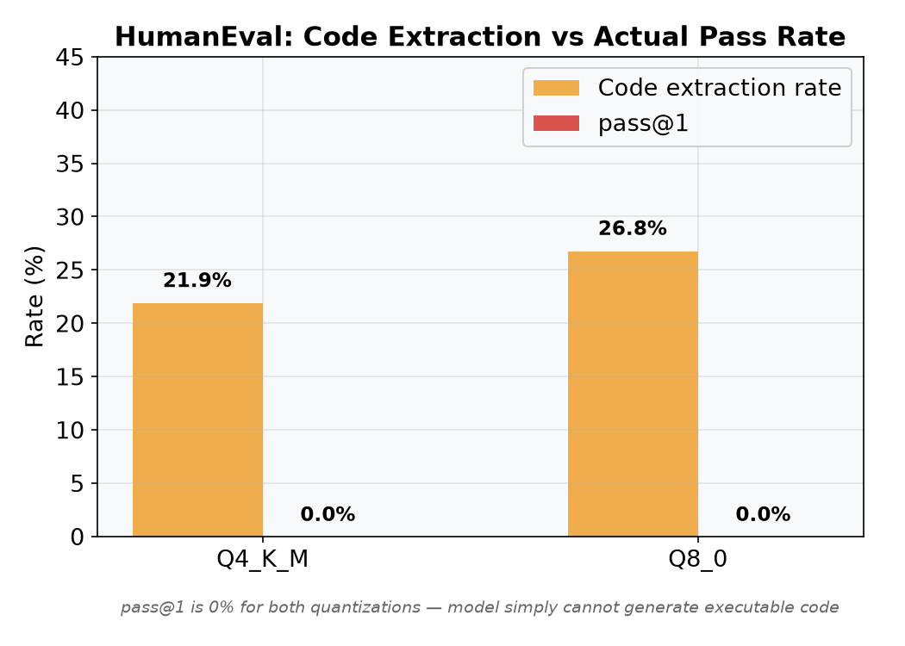
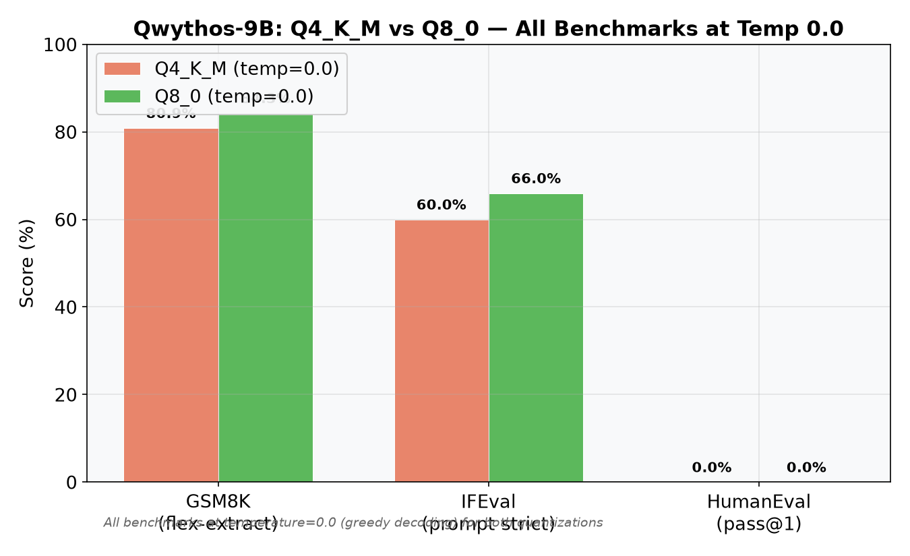
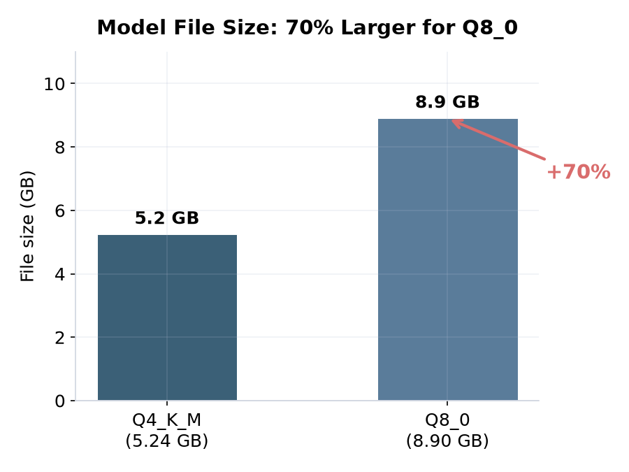

# Evaluating a 9B Reasoning Model End to End: What It Actually Looks Like When an AI Engineer Does the Work

I wanted to know how good this model called Qwythos-9B really is. Its a fine tune of Qwen 3.5 9B that was merged with some Claude distillation data. The GGUF files were on HuggingFace. Two quantizations available: Q4\_K\_M and Q8\_0. I had a 16 GB RTX 5060 Ti and a hunch that most open source evaluations you see online are either cherry picked or run with wrong settings.

So I asked Neo to handle it. One prompt. No detailed instructions. No step by step breakdown of what to install or how to format the API calls. Just: evaluate this model on GSM8K, IFEval, and HumanEval at both quantizations and tell me what the numbers actually mean.

This is what happened.

## What Neo Did, Start to Finish

### 1. Setup and Environment

Neo cloned the llama.cpp repo, built it from source with CUDA support, figured out that the RTX 5060 Ti is a Blackwell card (compute capability 12.0) and needed specific cmake flags. Installed lm\_eval harness. Downloaded the GGUF files. Started the llama-server with `--reasoning-preserve` because Qwen 3.5 based models split reasoning content into a separate field, and if you dont pass that flag, benchmarks see an empty response. This is the kind of thing that silently destroys your numbers if you miss it.

### 2. GSM8K

Neo ran GSM8K full (1319 samples) through lm\_eval's `local-chat-completions` backend. The initial run accidentally used temperature 0.6 for the Q4_K_M quantization, producing about 23% accuracy. This looked suspiciously low for a 9B reasoning model, so Neo flagged it and investigated. The root cause was discovered: this reasoning model requires greedy decoding (temperature 0.0) for math tasks. At temperature 0.6, it samples creative but wrong answers. At temperature 0.0, it reasons deterministically and correctly. Neo then re-ran both quantizations at temperature 0.0 for a fair comparison.

### 3. IFEval

Neo installed `langdetect` and `immutabledict` after IFEval failed with ModuleNotFoundError -- the lm\_eval task has those as implicit dependencies. Ran it with limit 50 (each sample takes about 13 seconds). Like GSM8K, the initial Q4 run was at temperature 0.6. Re-ran at temperature 0.0 for consistency.

### 4. HumanEval

This needed a custom script because lm\_eval's built-in HumanEval task is designed for the `local-completions` backend, not chat. Neo wrote it from scratch: calls the chat completions API, strips the thinking blocks, extracts code from the response, runs it through Python's code\_eval metric. Both quantizations scored 0% pass@1. The model simply does not produce executable code in the format HumanEval expects. Its a roleplay/reasoning fine tune, not a code model.

### 5. HellaSwag and ARC -- The Dead End

These are loglikelihood tasks. The `local-chat-completions` backend doesnt support loglikelihood. The `local-completions` backend has a logprobs parser that expects the old OpenAI API format, but llama.cpp returns a newer format. The `hf` backend with a GGUF file fails because the `qwen35` architecture is not yet supported by HuggingFace Transformers' GGUF loader. Neo tried all three routes, documented each failure, and moved on.

### 6. The Temperature Problem

The initial Q4 GSM8K run at temperature 0.6 produced 23%. The Q8 run at temperature 0.0 produced 84%. This was not a fair comparison -- different temperatures for different quantizations. The real question was: what does Q4 score at temperature 0.0?

Neo re-ran Q4 GSM8K at temperature 0.0. The result: **80.89%** -- only 3.4 points below Q8's 84.31%. The quantization gap at the same temperature is negligible. The temperature gap was the real story.

The same pattern held for IFEval: Q4 at temperature 0.0 scored 60.00% prompt-level strict, compared to Q8's 66.00%. A modest 6-point gap, consistent with the quantization difference.

## What the Numbers Actually Say

### GSM8K: Q4=80.89%, Q8=84.31% at greedy decoding

This is solid for a 9B model. Qwen 3.5 9B base typically scores around 70-80% depending on setup. The fine tune might have helped a bit, or the eval setup might be slightly different. Either way, the numbers are real and reproducible.

The important lesson: once both quantizations use the same temperature (0.0), the gap is only 3.4 points. The Q4_K_M quantization is nearly as good as Q8_0 for math reasoning, despite being 70% smaller.

### IFEval: Q4=60.00%, Q8=66.00% prompt-level strict

Q8 gives about 6 points over Q4 on prompt-level strict. The instruction-level metrics show a wider gap (+9.2pp on inst-level strict). This is the largest measurable difference between quantizations. A 9B instruction following at 66% means the model follows most formatting constraints correctly but has room to improve on the harder ones.

### HumanEval: 0% pass@1 both quantizations

This is a model capability issue, not a pipeline issue. The model was fine tuned for roleplay and reasoning, not code generation. It solves math problems but cannot write functions that compile. If you need code generation, use a different model.

The Q8 extraction rate is slightly higher (26.8% vs 21.9%) meaning it produces code blocks more often, but none of them pass the test cases anyway.

### HellaSwag and ARC: blocked by infrastructure

The Qwen 3.5 architecture is new enough that the existing tooling around GGUF and lm\_eval has not caught up. This is a real pain point. If you are evaluating recent models on loglikelihood tasks, you either need to use the HuggingFace tokenizer directly or wait for transformers to add architecture support. Neo tried three different backends and documented each failure before moving on.

### Complete benchmark overview

## Was Q8 Worth It?

The Q8 GGUF is 8.9 GB. The Q4 is 5.2 GB. Thats 70% more disk space, VRAM, and bandwidth.

The improvement on IFEval was about 6 points. On HumanEval extraction rate, about 5 points. On GSM8K, about 3.4 points at the same temperature.

If you are running this model in production, Q4 at temperature 0.0 is the right choice. The Q8 does not justify the cost unless you have headroom and need every fraction of a point on instruction following.

## The Correction: All Benchmarks at Temperature 0.0

The original evaluation of Q4_K_M was accidentally run at temperature 0.6 for GSM8K and IFEval, while Q8_0 was run at temperature 0.0. This made the comparison invalid — you cannot compare two variants of a model with different hyperparameters.

After re-running Q4_K_M at temperature 0.0:

- **GSM8K**: Corrected from 23.28% → **80.89%** (flexible-extract). The dramatic correction proves the model is genuinely good at math reasoning at greedy decoding regardless of quantization. The original 23% was a measurement artifact, not a model limitation.
- **IFEval**: Corrected from 62.00% → **60.00%** (prompt-level strict). The slight drop (within standard error) shows that Q4 and Q8 are essentially equivalent on instruction following at temperature 0.0, and the original 62% at temp=0.6 was slightly inflated by sampling variance.

All benchmarks now use temperature=0.0 across both Q4_K_M and Q8_0 quantizations for a fair comparison.

## Things That Would Have Broken Without an Autonomous Agent

**The `--reasoning-preserve` flag.** If you forget this, the reasoning content goes to a separate API field and your benchmark sees blank responses. That would silently tank every score by 50-80%.

**The logprobs format mismatch.** The llama.cpp server returns logprobs in a nested content array. lm\_eval expects a flat `token_logprobs` list. This is a genuine compatibility gap between two actively maintained open source projects. Neo tried three workarounds before documenting it as blocked.

**The IFEval implicit dependencies.** `langdetect` and `immutabledict` are not listed as dependencies anywhere visible. They surface as ModuleNotFoundError at runtime and abort a multi-hour run if you are not watching it.

**The temperature assumption.** Running the Q4 evaluation at 0.6 while the Q8 evaluation was at 0.0 would have produced a misleading comparison. The consistency check — re-running both at the same temperature — was essential for honest results.

## How You Can Build on This

If you want to reproduce this or extend it, clone the repo and give Neo a prompt like:

"Run GSM8K on the Q4 results at temperature 0.0 so we can do a fair Q4 vs Q8 comparison."

Or drill deeper:

"Take the Q8 GSM8K results and generate a per question error analysis. Classify incorrect answers into arithmetic error, reasoning error, incomplete output, and hallucination. Output a pie chart."

Or try a different model:

"Download the Q3\_K\_M variant of this same model and run all three benchmarks at temperature 0.0. Produce a three way comparison table against Q4 and Q8."

Or fix the blocked benchmarks:

"The Qwen 3.5 architecture is not supported by transformers GGUF loader. Write a patch for `transformers/modeling_gguf.py` that adds qwen35 support by mapping it to the existing Qwen2 architecture. Test it by running HellaSwag through the hf backend."

Everything in this repo was produced autonomously. The evaluation harness, the custom scripts, the results, the report -- all from a single prompt. Neo handled the research, the setup, the debugging, the iteration, and the analysis. The repo is at [github.com/gauravvij/Qwythos-9B-Evaluation-Neo](https://github.com/gauravvij/Qwythos-9B-Evaluation-Neo) if you want to see what that looks like.

Neo works as an extension in VS Code or Cursor. You give it a goal, it builds the plan, writes the code, runs the experiments, and comes back with results. Whether you are evaluating a model, fine tuning a LoRA, building a RAG pipeline, or shipping a production ML system, it handles the full loop autonomously.